# ✅ Task Manager App
A sleek and intuitive mobile app built with React Native and Firebase that helps users manage their daily tasks effectively. The app allows users to:

➕ Add new tasks  
📝 Edit existing tasks  
✅ Mark tasks as completed  
❌ Delete tasks  
📄 View full task descriptions  
⚡ Set task priority and deadline  
🔔 Automatically trigger local notifications as reminders

Designed for simplicity, speed, and productivity — all in one place.

# 🖼️ Screenshots

<p align="center">
  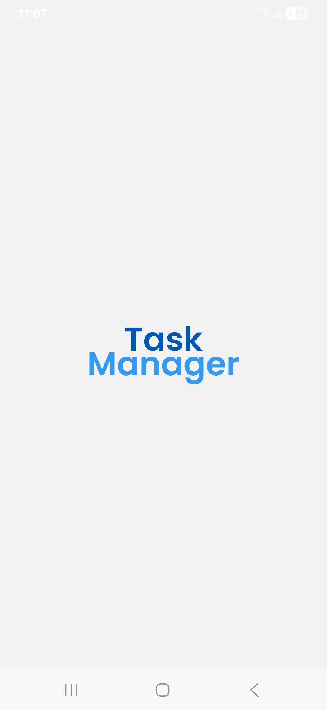
  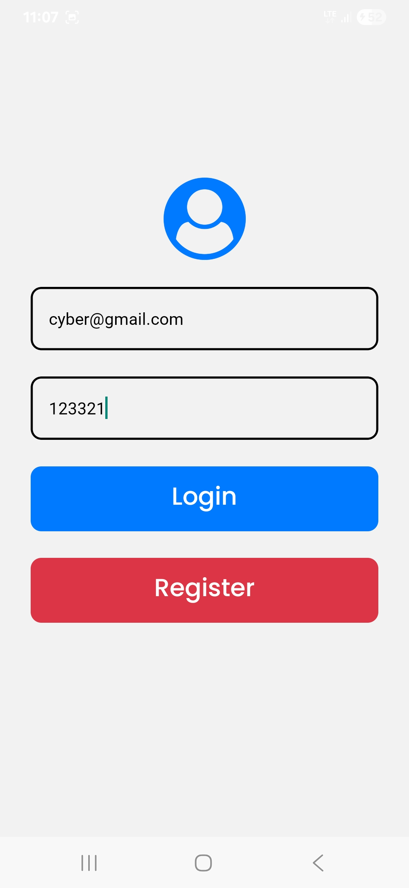
  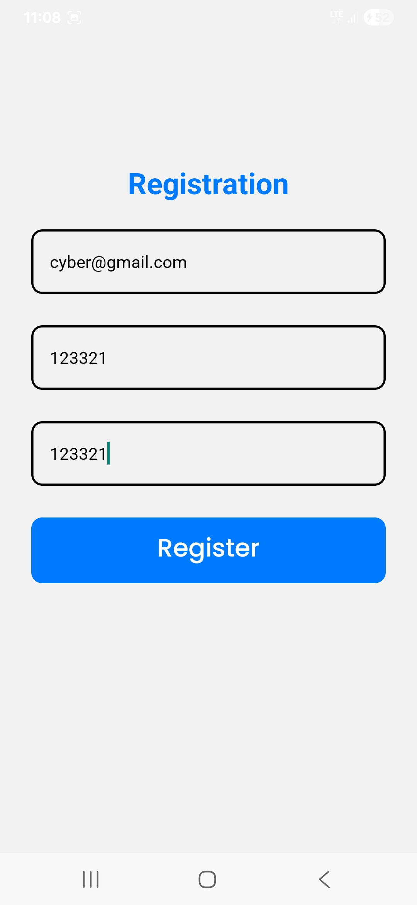
  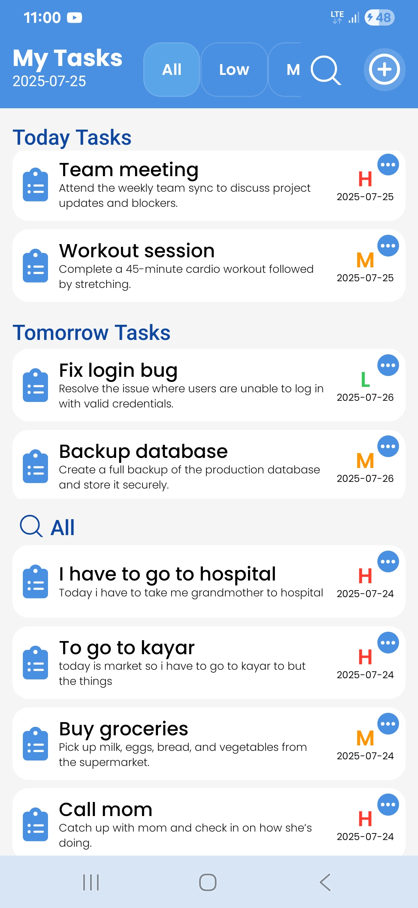
  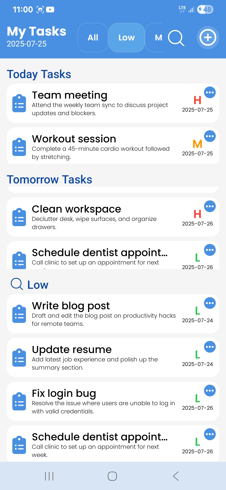
  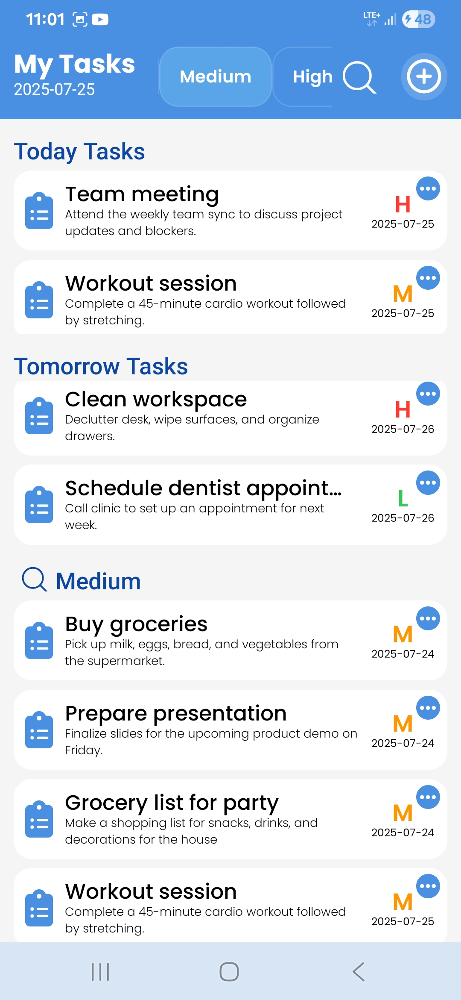
  
  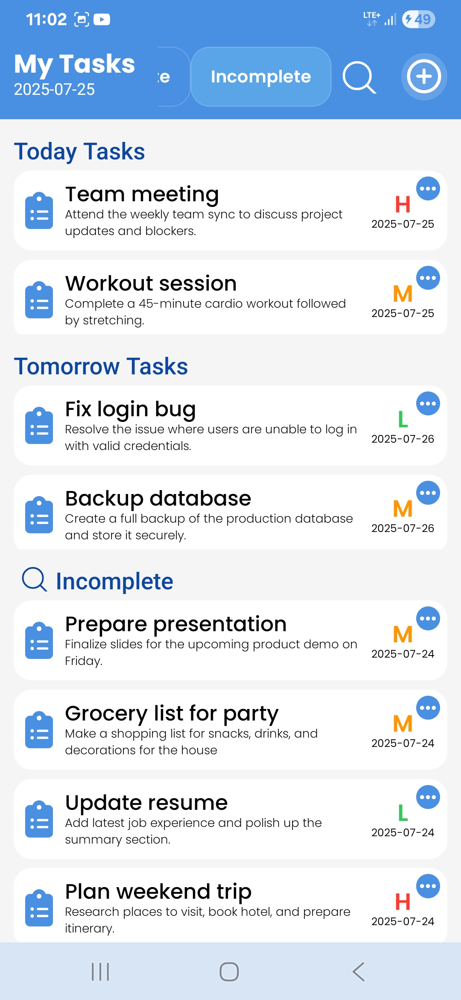
  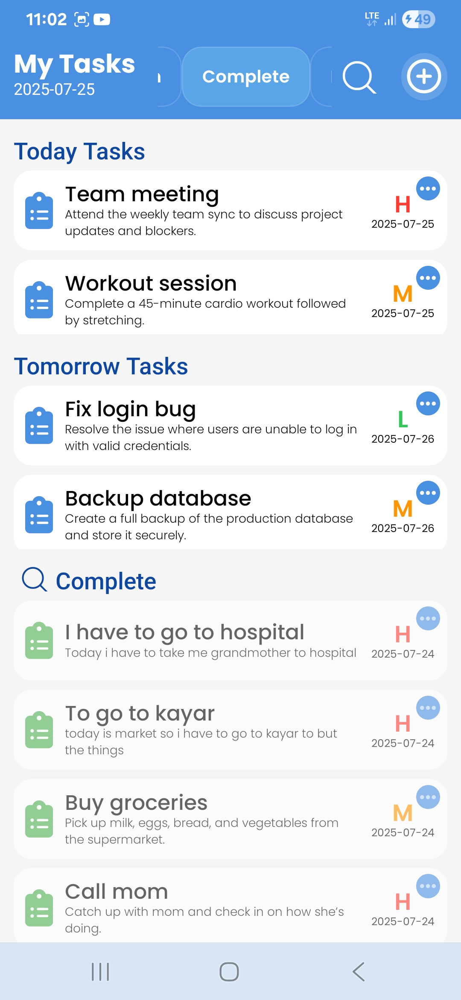
  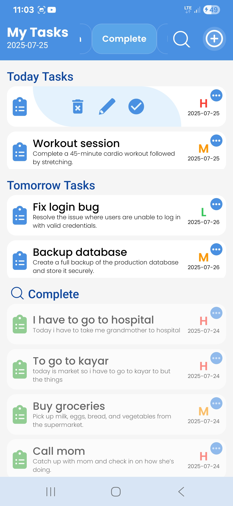
  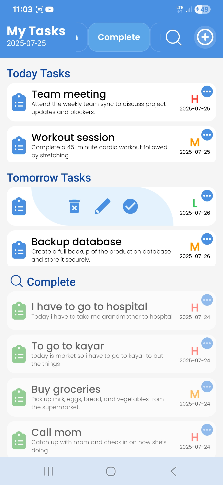
  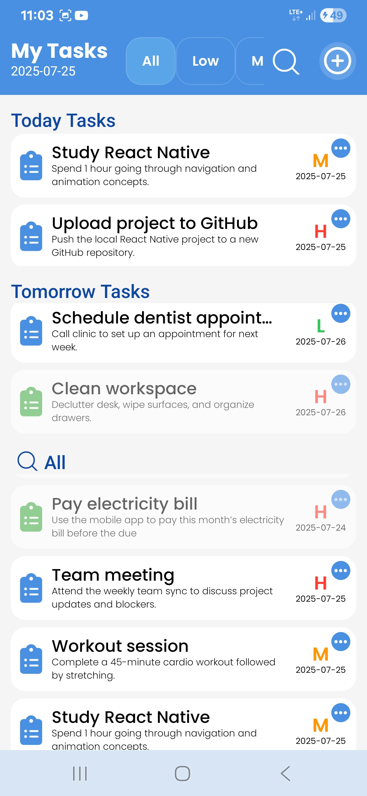
  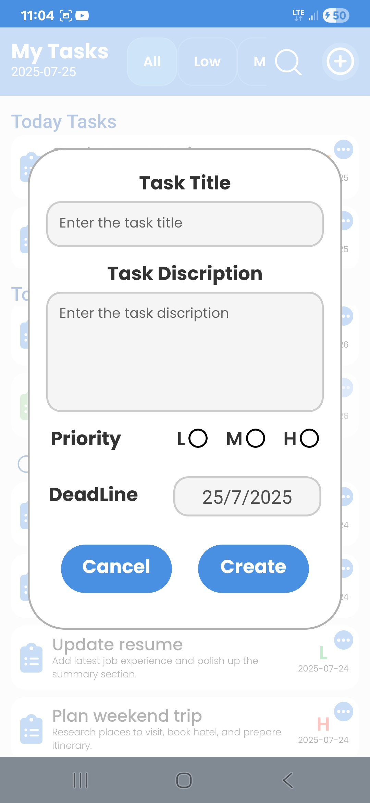
  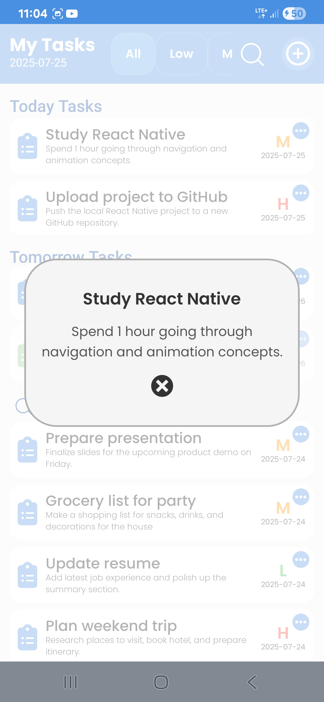
  
  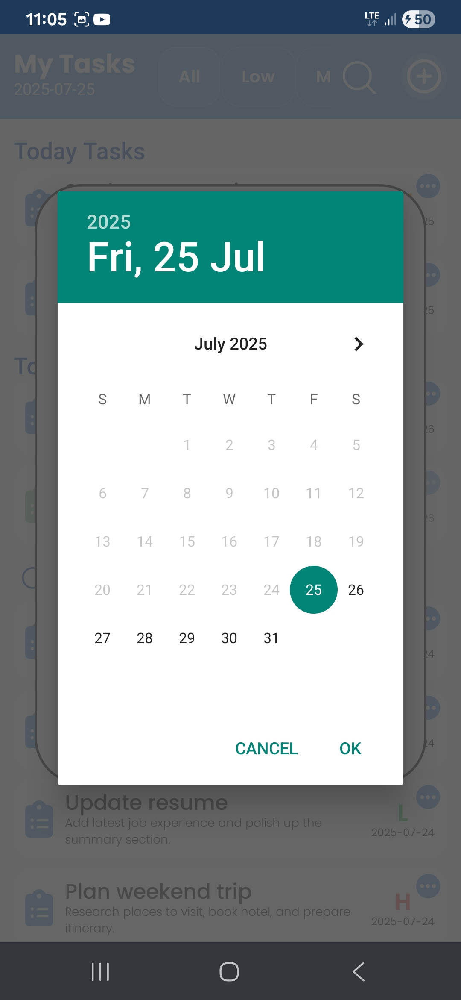
  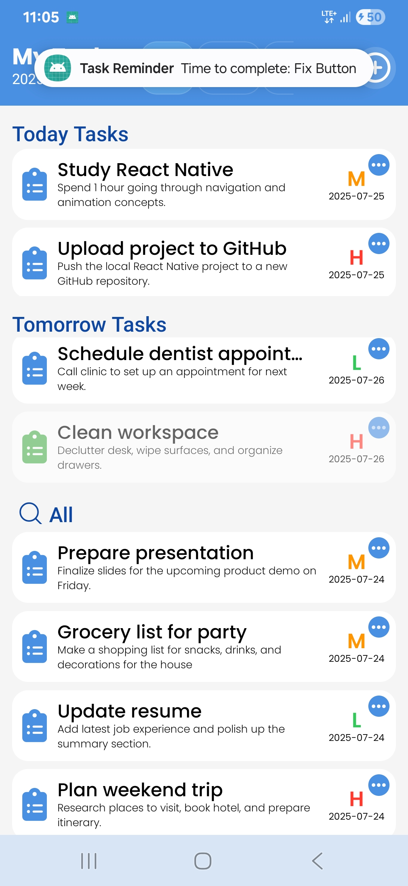
  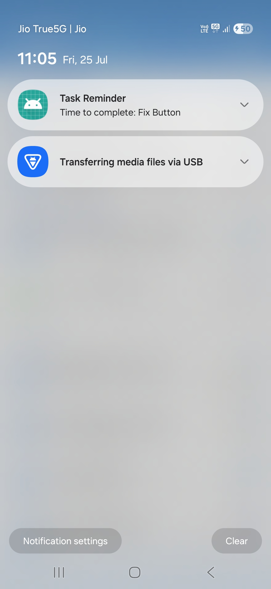
</p>

# 🚀 Setup Instructions

This guide walks you through setting up the **TaskManager React Native project**, installing dependencies, and handling common issues.

  

---

  

## 📌 1️⃣ Create a New React Native Project

To set up the project, run the following command:

  

```sh

npx @react-native-community/cli init ProjectName

```

  

This will initialize a new React Native project named **ProjectName**.

  

Once the installation is complete, navigate into the project directory:

  

```sh

cd ProjectName

```

  

Then, start the development server and launch the app on an Android device or emulator:

  

```sh

npm run android

```

  

---

  

## 🔹 Troubleshooting Build Failures

If the build fails, try cleaning the Gradle cache and rebuilding the project:

  

```sh

cd android && gradlew clean

```

  

After cleaning, go back to the main project directory and rerun the build:

  

```sh

cd  ..

npm run android

```

  

---

  

## 🔹 Ensure Node.js and npm Are Up to Date

Before proceeding, make sure that both **Node.js** and **npm** are up to date, as outdated versions may cause compatibility issues.

  

---

  

# 🔥 Firebase Integration Guide

  

## 📌 1️⃣ Create a Firebase Project

Before integrating **Firebase** into your React Native app, you need to set up a Firebase project:

  

1. Go to [Firebase Console](https://console.firebase.google.com/).

2. Click on **"Create a Project"** and follow the on-screen instructions.

3. Once the project is created, navigate to **Project Settings** and select the **General** tab.

  

---

  

## 📌 2️⃣ Add Firebase to Your Android App

1. In **Project Settings**, scroll down to **"Your apps"** and click **"Add App" → Select Android**.

2. Enter your **Android package name** (you can find it in `android/app/src/main/AndroidManifest.xml`).

3. Download the `google-services.json` file and move it into:

  

```sh

android/app/

```

  

4. Click **Next** until setup is complete.

  

---

  

## 📌 3️⃣ Install Firebase Dependencies

To install Firebase in **React Native**, run:

  

```sh

npm install @react-native-firebase/app

```

  

This package provides Firebase core functionality, required for any Firebase service (**Authentication, Firestore, etc.**).

  

---

  

## 📌 4️⃣ Configure Firebase in Android Project

After installing Firebase, some changes are required in your Gradle files.

  

### 🔹 Modify `/android/build.gradle`

Open the file:

  

```sh

android/build.gradle

```

  

Inside the dependencies section, add:

  

```gradle

classpath 'com.google.gms:google-services:4.4.2'

```

  

### 🔹 Modify `/android/app/build.gradle`

Open the file:

  

```sh

android/app/build.gradle

```

  

At the bottom of the file, add:

  

```gradle

apply plugin: 'com.google.gms.google-services'

```

  

---

  

## 📌 5️⃣ Sync and Rebuild the Project

After making these changes, run the following command to apply the configuration:

  

```sh

npm run android

```

  

---

  

# 📦 Install Required Libraries

  

## 📌 Install React Native Vector Icons

React Native Vector Icons provides a set of customizable icons for use in your app.

  

To install it, run:

  

```sh

npm install react-native-vector-icons

```

  

### ⚠ Fix: Icons Not Displaying Correctly on Android

If the icons are not appearing as expected, you may need to manually link the fonts in your Android project:

  

1. Open the file:

  

```sh

android/app/build.gradle

```

  

2. Add the following line at the bottom of the file:

  

```gradle

apply from: "../../node_modules/react-native-vector-icons/fonts.gradle"

```

  

3. Rebuild the project:

  

```sh

npm run android

```

  

---

  

## 📌 Install React Navigation (For Screen Transitions)

React Navigation is used for handling navigation between screens in React Native apps.

  

### 🔹 Step 1: Install Core Navigation Package

Run the following command to install the core navigation package:

  

```sh

npm install @react-navigation/native

```

  

### 🔹 Step 2: Install Required Dependencies

React Navigation requires additional dependencies to work properly:

  

```sh

npm install react-native-screens react-native-safe-area-context react-native-gesture-handler react-native-reanimated react-native-vector-icons

```

  

### 🔹 Step 3: Install Stack Navigation (For Screen-Based Navigation)

To enable stack-based navigation, install:

  

```sh

npm install @react-navigation/native-stack

```

  

---

  

## 📌 Install AsyncStorage (For Persistent Data Storage)

AsyncStorage allows you to store small amounts of persistent data, such as user sessions and preferences.

  

To install it, run:

  

```sh

npm install @react-native-async-storage/async-storage

```

  

---

  

## 📌 Install Firebase Authentication.

Firebase Authentication module for React Native.

  

To install it, run:

  

```sh

npm install @react-native-firebase/auth

  

```

---

## 📌 Install Firebase Cloud Firestore

Firebase Cloud Firestore database module for React Native.

  

To install it, run:

  

```sh

npm install @react-native-firebase/firestore

  

```

---

## 📌 Install react-native-paper

Material Design UI component library for React Native.

  

To install it, run:

  

```sh

npm install react-native-paper

  

```

---

## 📌 Install react-native-safe-area-context

Handles safe area insets on iOS and Android devices (e.g., notches).

  

To install it, run:

  

```sh

npm install react-native-safe-area-context

  

```

---

## 📌 Install react-native-community/datetimepicker

Native date and time picker component for React Native.

  

To install it, run:

  

```sh

npm install @react-native-community/datetimepicker

  

```

---

## 📌 Install @notifee/react-native

A powerful local notification library for React Native, supporting rich scheduling, triggers, channels, and full background handling on both Android and iOS.

  

To install it, run:

  

```sh

npm install @notifee/react-native

  

```

  

---

  

# 🚀 How to Run the App

Follow these steps to run the MyKisan React Native app on your device or emulator.

  

## 📌 1️⃣ Start the Metro Bundler

Navigate to the project folder and start the Metro bundler:

  

```sh

cd ProjectName

npm  start

```

  

This will start the development server.

  

---

  

## 📌 2️⃣ Run the App on Android

To launch the app on an Android emulator or physical device, run:

  

```sh

npm run android

```

  

### 🔹 Troubleshooting Build Issues

If the build fails, try cleaning the Gradle cache:

  

```sh

cd android && gradlew clean

```

  

Then return to the main project folder and run:

  

```sh

npm run android

```

  

Ensure your Android device or emulator is running and detected using:

  

```sh

adb devices

```
# ⬇️ Download & Try the App

You can try out the Sudoku app by downloading the APK from the link below:

👉 [Download TaskManager APK](https://drive.google.com/file/d/1zsmTFFaA_MmuPyfCQj43EryRi8YBwdea/view?usp=sharing)

---

✅ **App is Now Running!** 🎉

